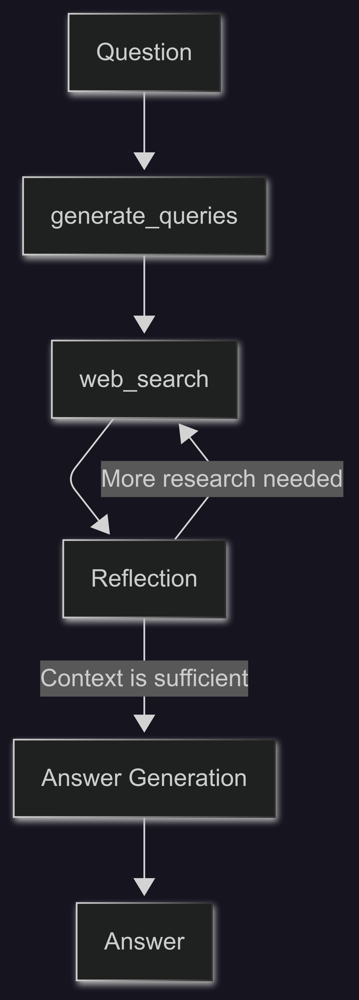

# LangGraph Agent - Your AI Research Companion

Transform the way you research with this intelligent AI agent that doesn't just search—it thinks, reflects, and delivers comprehensive answers backed by real sources. Built with cutting-edge LangGraph technology, this research assistant goes beyond simple web searches to provide you with thoughtful, well-researched responses to any question.


## What Makes This Special

- 🧠 **Intelligent Research**: Unlike basic search engines, this agent thinks critically about your questions and generates multiple search strategies
- 🔍 **Smart Search**: Dynamically creates search queries and uses Google Search to find the most relevant information
- 🤔 **Self-Reflection**: The agent analyzes its own findings, identifies gaps in knowledge, and refines its search approach
- 📚 **Source-Cited Answers**: Every response comes with proper citations from the web sources used
- ⚡ **Real-Time Processing**: Watch as the agent works through your research question step by step
- 🎨 **Beautiful Interface**: Clean, modern React frontend that makes research feel effortless

## Project Architecture

This is a full-stack application with two main components:

-   **Frontend** (`frontend/`): A sleek React application built with Vite, featuring real-time updates and a modern UI
-   **Backend** (`backend/`): A powerful LangGraph agent that handles all the intelligent research logic

## Quick Start Guide

Get your research assistant up and running in minutes.

### Prerequisites

You'll need:
- Node.js and npm (or yarn/pnpm)
- Python 3.11 or higher
- A Google Gemini API key (get one from [Google AI Studio](https://aistudio.google.com/))

### Setup Steps

**1. Configure Your API Key**

Navigate to the backend directory and set up your environment:
```bash
cd backend
cp .env.example .env
```

Then edit the `.env` file and add your Gemini API key:
```
GEMINI_API_KEY="your_actual_api_key_here"
```

**2. Install Dependencies**

Set up the backend:
```bash
cd backend
pip install .
```

Set up the frontend:
```bash
cd frontend
npm install
```

**3. Launch Your Research Assistant**

From the project root, run:
```bash
make dev
```

This starts both the backend and frontend servers. Open your browser to `http://localhost:5173/app` and start researching!

*Alternative: Run servers individually*
- Backend: `cd backend && langgraph dev` (available at `http://127.0.0.1:2024`)
- Frontend: `cd frontend && npm run dev` (available at `http://localhost:5173`)

## How the Magic Happens

The research agent works through a sophisticated process defined in `backend/src/agent/graph.py`:



1. **Question Analysis**: Your question gets analyzed and broken down into multiple search strategies
2. **Intelligent Search**: The agent generates search queries and scours the web for relevant information
3. **Critical Thinking**: It reflects on what it found, identifying what's missing or unclear
4. **Iterative Refinement**: If needed, it generates follow-up searches to fill knowledge gaps
5. **Synthesis**: Finally, it weaves everything together into a coherent, well-cited answer

## Command Line Research

Want to test the agent quickly? Use the command line interface:

```bash
cd backend
python examples/cli_research.py "What are the latest developments in quantum computing?"
```

Perfect for quick research questions without opening the full interface.

## Deploying Your Research Assistant

Ready to take your research assistant live? Here's how to deploy it in production.

The production setup uses Docker and requires Redis and PostgreSQL for optimal performance. Redis handles real-time streaming, while PostgreSQL stores conversation history and agent state.

**Build and Deploy:**

1. **Create the Docker Image:**
   ```bash
   docker build -t langgraph-agent -f Dockerfile .
   ```

2. **Launch with Docker Compose:**
   ```bash
   GEMINI_API_KEY=<your_key> LANGSMITH_API_KEY=<your_langsmith_key> docker-compose up
   ```

*Note: You'll need a LangSmith API key for production deployment. Get one from [LangSmith](https://smith.langchain.com/settings).*

Your research assistant will be available at `http://localhost:8123/app/`

## Tech Stack

This project leverages the best modern technologies:

- **Frontend**: React with Vite for lightning-fast development
- **Styling**: Tailwind CSS for beautiful, responsive design
- **Components**: Shadcn UI for polished, accessible components
- **Backend**: LangGraph for sophisticated AI agent orchestration
- **AI Models**: Google Gemini for intelligent text generation and reasoning

## License

This project is licensed under the Apache License 2.0. See the [LICENSE](LICENSE) file for details.

